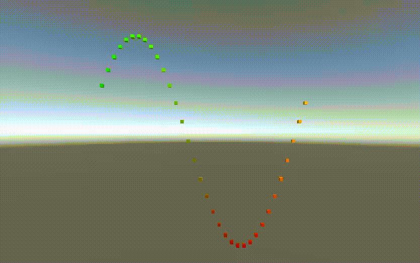

Building a Graph Visualizing Math

https://user-images.githubusercontent.com/87177008/141075535-54e29f87-06e2-421c-a155-d58287302aab.mp4

Unity Version: 021.2.1f1c1
Packages:
- Recorder
- Pipeline Asset(Universal Render Pipeline)

[ref](https://catlikecoding.com/unity/tutorials/basics/building-a-graph/#3.1)
